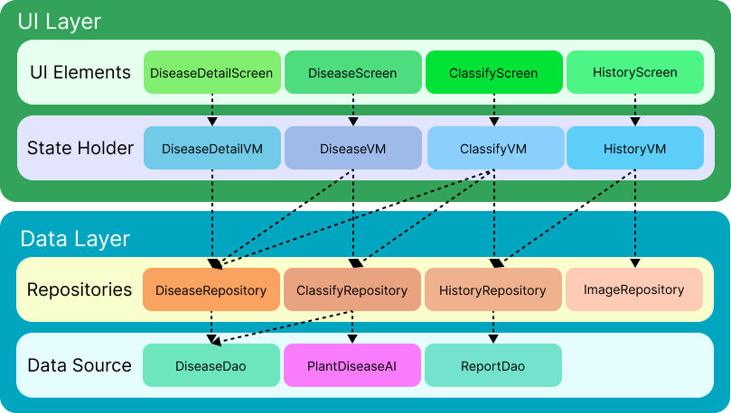
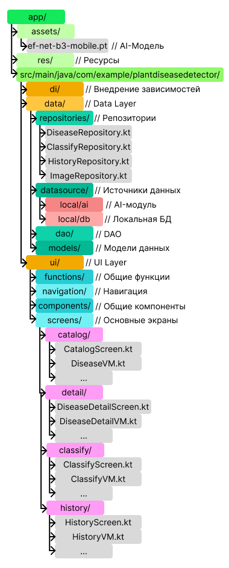

# Plant Disease Detector

## Быстрое меню
1. Архитектурные решения
    - mdbook: <https://alexforlinux.github.io/ai-sstu-2025/description.html>
2. Сбор данных и статистика
    - dataset.ipynb: <https://github.com/AlexForLinux/ai-sstu-2025/blob/main/dataset/dataset.ipynb>
    - colab: <https://colab.research.google.com/drive/1oMEN5bfms0DFudkMMg4GK-tEwGy_vIsL?usp=sharing>
3. Разработка системы
    - исходный код: <https://github.com/AlexForLinux/ai-sstu-2025/tree/main/PlantDiseaseDetector/app>
    - android app bundle: <https://drive.google.com/drive/folders/1CNydHQ77J6tSy6Lao3UBpmNq465NU7Xt?usp=sharing>
    - learning.ipynb: <https://github.com/AlexForLinux/ai-sstu-2025/blob/main/cnn-learning/learning.ipynb>
4. Выходной материал
    - В процессе...

## О приложении
Plant Disease Diagnoser - мобильное приложение для диагностики заболеваний растений по фотографиям с использованием искусственного интеллекта. Приложение помогает садоводам и дачникам быстро определить проблемы растений и получить рекомендации по лечению.

## Основные функции
1. Каталог заболеваний
    - Просмотр списка заболеваний в виде карточек
    - Поиск по описанию заболеваний
    - Система закладок для отслеживания важных заболеваний
    - Фильтрация по избранным заболеваниям
2. Диагностика по фото
    - Загрузка фотографий из галереи
    - Съемка фотографий через камеру
    - AI-анализ изображения с помощью CNN (EfficientNet)
    - Визуализация результатов в виде диаграммы
    - Текстовый отчет с ссылками на вероятные заболевания
3. История диагностик
    - Просмотр всех предыдущих диагностик
    - Удаление отчетов диагностик по желанию пользователя

## Технологический стек

[-1D63ED)]()

### Платформа и язык
- Платформа: Android (min SDK - 28 (Android 9), target SDK - 36 (Android 16))
- Язык программирования: Kotlin

### Пользовательский интерфейс
- UI Framework: Jetpack Compose
- Дизайн-система: Material Design 3
- Навигация: Navigation Component

### Внедрение зависимостей
- Фреймворк: Dagger Hilt

### Локальное хранение
- База данных: Room (абстракция над SQLite)

### Нейросетевые технологии
- Фреймворк обучения: PyTorch (Python)
- Фреймворк вывода на устройство: PyTorch Mobile
- Архитектура модели: Сверточная Нейронная Сеть - CNN (EfficientNet)
- Формат модели: .pt (TorchScript)

### Сборка и деплой
- Система сборки: Gradle (Kotlin DSL)
- Менеджер пакетов: Gradle Version Catalog

## Архитектура Приложения

### UI Layer
#### Основные компоненты UI (UI Elements):
- DiseaseScreen - экран каталога заболеваний
- DiseaseDetailScreen - детальная страница заболевания
- ClassifyScreen - экран диагностики по фото
- HistoryScreen - экран истории диагностик
#### State Holder (ViewModels)
- DiseaseVM - управление состоянием каталога заболеваний
- ClassifyVM - управление процессом диагностики
- HistoryVM - управление историей отчетов
- DiseaseDetailVM - управление детальной информацией о заболевании

### Data Layer
#### Репозитории (Repositories)
- DiseaseRepository - работа с данными заболеваний
- ClassifyRepository - работа с AI-моделью классификации
- HistoryRepository - управление историей диагностик
- ImageRepository - работа с изображениями
#### Источники данных (Data Source)
- DiseaseDao - доступ к данным заболеваний (Room)
- ReportDao - доступ к истории отчетов (Room)
- PlantDiseaseAI - EfficientNet модель для классификации

## Характеристики обученной модели
- Точность (Accuracy): **88%**
- Precision, Recall и F1-Score:

| Класс          | Precision | Recall | F1-Score |
|----------------|-----------|--------|----------|
| 0 (Healthy)    | 0.86      | 0.87   | 0.87     |
| 1 (Powdery)    | 0.94      | 0.89   | 0.91     |
| 2 (Rust)       | 0.93      | 0.99   | 0.96     |
| 3 (Slug)       | 0.94      | 0.79   | 0.86     |
| 4 (Spot)       | 0.74      | 0.84   | 0.79     |

## Структура приложения

